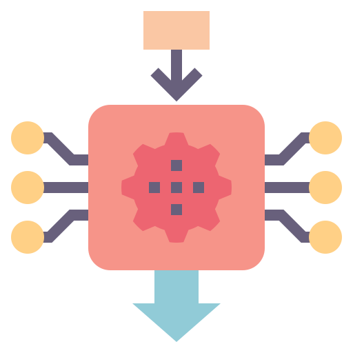
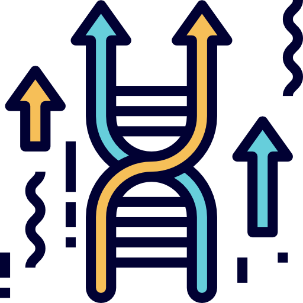

### Hi, I'm Giovanni

I recently completed my MSc in Computer Science and Engineering at Politecnico di Milano.\
I'm interested in the following fields:

 Artificial Intelligence

 Machine Learning 

 Deep Learning

 Evolutionary Computation

 Explainable AI

 Computer Ethics

---

### Some Projects I Worked On

- [`Explainable Pareto Fronts`](https://github.com/GiovanniN98/Explainable-Pareto-Fronts) : Thesis Project on applying XAI to Multi-Objective Optimization problems' Pareto Fronts

- [`Deep RL Survey`](https://github.com/Menta99/Advanced_Deep_Learning_Models_and_Methods-Menta-Nisti) : A Survey on Deep Reinforcement Learning Models applied to Zero-Sum Games
  
- [`Santorini`](https://github.com/Menta99/ing-sw-2020-menta-nisti-manocchio) : Client-Server version of Santorini board game (GUI + CLI)

- More soon

---

### Contacts

 giovanni.nisti@gmail.com\
 [Linkedin](https://www.linkedin.com/in/giovanni-nisti-9b9732174/)

